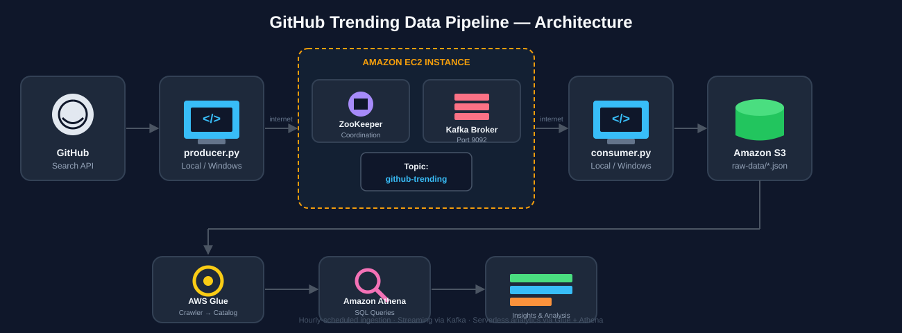

# GitHub Trending Data Pipeline

A real-time data pipeline that ingests newly-created, high-momentum GitHub repositories, streams them through Apache Kafka, lands them in a data lake on Amazon S3, and makes them queryable with SQL via AWS Glue and Athena.

---

## Architecture



**Flow:** GitHub Search API → Python Producer → Kafka (on EC2) → Python Consumer → Amazon S3 → AWS Glue Crawler → Amazon Athena

---

## Tech Stack

| Layer | Technology |
|---|---|
| Data source | GitHub REST Search API |
| Message streaming | Apache Kafka 3.5.0 (self-hosted on EC2) |
| Coordination | Apache ZooKeeper |
| Compute | Amazon EC2 (t2.micro, Amazon Linux 2023) |
| Storage | Amazon S3 |
| Schema discovery | AWS Glue Crawler |
| Query engine | Amazon Athena (SQL) |
| Language | Python 3 (`kafka-python`, `boto3`, `requests`) |

---

## What This Project Does

Instead of ranking repositories by all-time star count (which always surfaces the same famous, decade-old projects), this pipeline surfaces repositories that were **created recently and are already gaining meaningful traction** — a practical proxy for "trending right now," since GitHub's public API doesn't expose star-velocity directly.

1. **`producer.py`** queries GitHub's Search API for repositories created within a rolling window (default: 7 days), sorted by star count, and publishes each one as a JSON message to a Kafka topic.
2. **Kafka**, running on an EC2 instance, buffers these messages — decoupling the ingestion rate from the processing rate.
3. **`consumer.py`** reads messages off the topic and writes each one as an individual JSON object into an S3 bucket.
4. **AWS Glue** crawls the S3 bucket, infers the schema, and registers it as a table in the Glue Data Catalog.
5. **Amazon Athena** queries that table directly with standard SQL — no database server, no data loading step.

---

## Setup

### Prerequisites
- Python 3.7+
- An AWS account (Free Tier is sufficient)
- AWS CLI configured (`aws configure`)

### Local Setup
```bash
git clone <this-repo-url>
cd github-trending-pipeline
python -m venv venv
venv\Scripts\activate        # Windows
pip install -r requirements.txt
```

### Configure
Create a `config.py` (not committed — see `.gitignore`) with:
```python
KAFKA_BROKER = "<your-ec2-public-ip>:9092"
KAFKA_TOPIC = "github-trending"
GITHUB_API_URL = "https://api.github.com/search/repositories"
AWS_REGION = "ap-south-1"
S3_BUCKET = "<your-s3-bucket-name>"
```

### Infrastructure
1. Launch an EC2 instance (Amazon Linux 2023, t2.micro) with inbound rules for ports `22` (SSH) and `9092` (Kafka).
2. Install Java and Kafka, then start ZooKeeper and the Kafka broker.
3. Create the topic: `github-trending`.
4. Create an S3 bucket for raw data.
5. Run `producer.py` locally to send data.
6. Run `consumer.py` locally to persist it to S3.
7. Create a Glue database and run a crawler against the S3 bucket.
8. Query the resulting table in Athena.

---

## Sample Queries

```sql
-- Top 5 repos by stars
SELECT name, owner, stars, language
FROM raw_data
ORDER BY stars DESC
LIMIT 5;

-- Average stars by language
SELECT language, COUNT(*) AS repo_count, AVG(stars) AS avg_stars
FROM raw_data
WHERE language IS NOT NULL
GROUP BY language
ORDER BY avg_stars DESC;
```

---

## Design Notes & Tradeoffs

- **Why Kafka for this scale?** Honestly, at 10 records/hour, a direct write to S3 (e.g., via a scheduled Lambda) would be simpler and cheaper. Kafka was used here deliberately to learn streaming architecture — producer/consumer decoupling, buffering, and the operational patterns that matter once ingestion volume, multiple consumers, or replay requirements justify it.
- **Why "created date + stars" instead of true trending?** GitHub's public API has no endpoint for star-velocity (stars gained per day). Filtering by recent creation date and sorting by star count is a defensible proxy that surfaces genuinely fresh, high-momentum projects without scraping GitHub's HTML trending page.
- **EC2 public IP changes on every stop/start.** This project intentionally doesn't use an Elastic IP to keep it within Free Tier cost boundaries — `advertised.listeners` in `server.properties` needs updating after each restart.

---


## Author

Built as a hands-on learning project covering distributed messaging, cloud infrastructure, and serverless analytics.